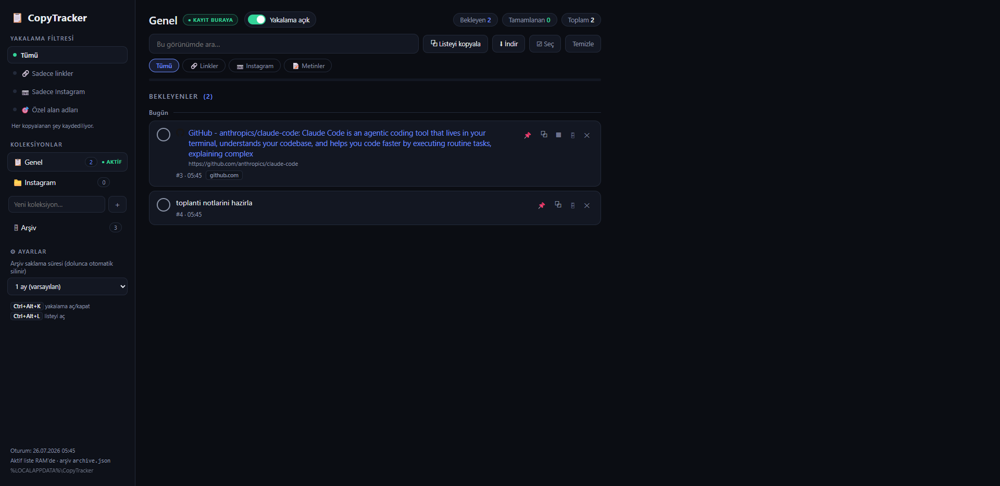

# 📋 CopyTracker


**A clipboard inbox for Windows** — every `Ctrl+C` is captured instantly, shown as a
notification, and queued in a local web UI where you process items like a to-do
list: click a link → it opens → gets checked off → drops to "Done".

Think of it as the missing bridge between clipboard managers (Ditto, CopyQ) and
read-later apps (Pocket, Wallabag): automatic capture **and** a triage workflow.



*UI language is Turkish. English localization PRs welcome.*

## Features

- **Instant capture** — native Win32 clipboard listener (`AddClipboardFormatListener`), no polling
- **To-do flow** — click a link to open it in a new tab; it's checked off and drops down; progress bar tracks completion
- **Collections** — open a "library"; new copies are routed into the active collection
- **Capture filters** — everything / links only / Instagram only / your own domain list
- **View filters + search** — slice what's shown: links, Instagram, plain texts
- **RAM-first storage** — the active list is never persisted as data; the only thing written
  while you work is a crash-recovery shadow (`session_backup.json`), deleted on clean exit
- **Archive with retention** — archived items auto-delete after 1 hour / 1 day / end of day / 1 month (default) / never
- **Crash recovery** — a shadow snapshot offers restore after an unclean shutdown
- **Page titles** — link items show the fetched page title instead of a bare URL
- **Smart duplicates** — re-copying the same content bumps a ×N badge instead of creating a new row; completed items are revived
- **Bulk actions** — multi-select → copy / archive / delete; copy the whole list or download as `.txt`
- **Pin** 📌, **QR codes** ▦ (open links on your phone), **copy-back** ⧉ (without re-capturing)
- **System tray** — toggle capture, open the list, quit
- **Global hotkeys** — `Ctrl+Alt+K` toggle capture, `Ctrl+Alt+L` open the list
- **Own notification popups** — bottom-right toasts that work even when Windows notifications are disabled

## Privacy & security

- Everything stays **local** (`127.0.0.1`). Two kinds of outbound request exist, both
  only for links you copied: the page-title fetch (directly to that site) and the
  favicon, which is requested from **`icons.duckduckgo.com`** — meaning the hostname of
  every link you copy is seen by DuckDuckGo. Delete the `fav.src` line in
  `web/index.html` if you would rather it didn't.
- Copies flagged by password managers (`ExcludeClipboardContentFromMonitorProcessing`)
  are **never** recorded.
- The local API is CSRF-protected (custom header + origin checks), so web pages you
  visit cannot read or wipe your list.
- `settings.json`, `archive.json`, logs and session snapshots are gitignored — they
  contain personal clipboard data. Never commit them.

Found a vulnerability? Please **do not** open a public issue — email the maintainer
instead (see the repository profile).

## Requirements

- Windows 10/11
- Python 3.10+ (with tkinter, included in the standard installer)

## Install & run

```bat
pip install -r requirements.txt
start.bat        :: starts in the background and opens http://localhost:8765
```

| Action | How |
|---|---|
| Run with console logs | `python copytracker.py` |
| Stop | tray icon → **Çıkış** (Quit), or `stop.bat` |
| Web UI | http://localhost:8765 |

## Data layout

Personal data is stored **outside the repository**, in `%LOCALAPPDATA%\CopyTracker`:

| Data | File | Behaviour |
|---|---|---|
| Active list | *(none — RAM only)* | volatile by design — gone when the app exits |
| Archive | `archive.json` | written only when you archive; auto-purged per retention rule |
| Settings + collections | `settings.json` | persistent |
| Crash shadow | `session_backup.json` | deleted on clean exit; offered for restore after a crash |

> **Note for Microsoft Store Python users:** the Store build virtualizes `%LOCALAPPDATA%`,
> so the real folder is under
> `%LOCALAPPDATA%\Packages\PythonSoftwareFoundation.Python.<ver>\LocalCache\Local\CopyTracker`.
> The exact path is printed at startup in the log and shown at the bottom of the sidebar.

## Known limitations

- **Windows only** — the capture layer is Win32 (`AddClipboardFormatListener`).
- **The active list is volatile by design.** Archive anything you want to keep.
- **Port 8765 is hardcoded.** If another app holds it, CopyTracker refuses to start
  and says so in the log.
- **Single instance** — starting it again just opens the existing UI.
- The global hotkeys silently fall back if another app already owns them (logged).
- The UI is **Turkish only** for now.
- Runs on Flask's development server. That is fine here because it is bound to
  loopback and single-user, but do not expose it to a network.
- Non-text clipboard content (files, images) is intentionally not captured.

## Documentation in Turkish

Türkçe belgeler için: [README.tr.md](README.tr.md)

## License

[MIT](LICENSE)
